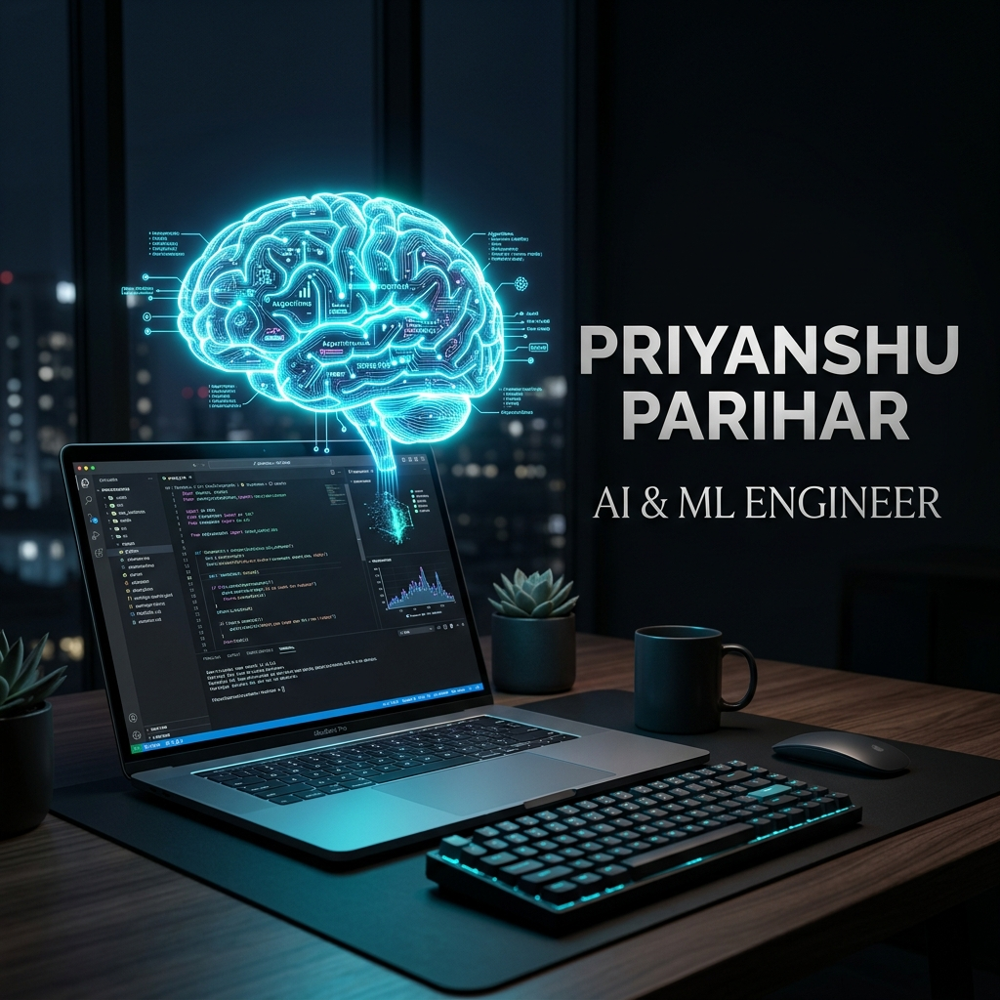

# 🚀 Priyanshu Parihar — AI/ML Engineer Portfolio



> A modern, interactive personal portfolio built with **Next.js 16**, **TypeScript**, **Tailwind CSS**, and **Three.js** — showcasing my expertise in AI/ML engineering, RAG systems, and LLM development.

---

## ✨ Features

- **Dark Glassmorphic Design** — Premium dark theme with glowing accents and glassmorphism UI
- **3D Interactive Skills Graph** — Rotating 3D node constellation built with `@react-three/fiber`
- **AI Chatbot (Groq-powered)** — Floating Sparkles assistant powered by **Llama 3.3 70B** via Groq API, trained on my portfolio data
- **3D Tilt Cards** — Interactive parallax tilt effects on contact and project cards
- **Click-to-Copy Contact Info** — One-click email & phone copy with animated checkmark feedback
- **Confetti Success Animation** — Celebratory `canvas-confetti` burst on form submission
- **Live Availability Status** — Pulsing badge showing current availability for work
- **Custom Animated Cursor** — Unique cursor experience across the whole site
- **Smooth Scroll Animations** — Page-wide entrance animations via `framer-motion`
- **Fully Responsive** — Optimized for all screen sizes

---

## 🛠️ Tech Stack

| Category | Technologies |
|---|---|
| **Framework** | Next.js 16 (App Router, Turbopack) |
| **Language** | TypeScript |
| **Styling** | Tailwind CSS v4 |
| **Animations** | Framer Motion |
| **3D Graphics** | Three.js, @react-three/fiber, @react-three/drei |
| **AI Chatbot** | Groq API (Llama 3.3 70B Versatile) via AI SDK |
| **Icons** | Lucide React, React Icons |
| **Tilt Effects** | react-parallax-tilt |
| **Confetti** | canvas-confetti |
| **Contact Form** | FormSubmit.co |

---

## 🤖 About the AI Chatbot

The floating **Sparkles** chatbot in the bottom-right corner is powered by the **Groq API** running **Llama 3.3-70B-Versatile** — one of the fastest and most capable open-source LLMs available.

It is pre-trained with my full portfolio context including:
- My skills & project details
- Work experience (Pharma Spine AI, Unified Mentor)
- Education & certifications
- Contact information

Visitors can ask it anything about my background and get instant, accurate answers.

---

## 📂 Project Structure

```
Portfolio/
├── app/
│   ├── api/chat/route.ts    # Groq-powered chatbot API endpoint
│   ├── layout.tsx
│   └── page.tsx
├── components/
│   ├── sections/
│   │   ├── Hero.tsx
│   │   ├── About.tsx
│   │   ├── Skills.tsx
│   │   ├── Experience.tsx
│   │   ├── Projects.tsx
│   │   ├── Education.tsx
│   │   ├── Contact.tsx
│   │   └── ...
│   └── ui/
│       ├── Chatbot.tsx      # Floating AI assistant
│       ├── Navbar.tsx
│       ├── CustomCursor.tsx
│       └── ...
└── public/
```

---

## ⚙️ Getting Started

### 1. Clone the repository

```bash
git clone https://github.com/Priyanshu1360/portfolio.git
cd portfolio
```

### 2. Install dependencies

```bash
npm install
```

### 3. Set up environment variables

Create a `.env.local` file in the root directory:

```env
GROQ_API_KEY=your_groq_api_key_here
```

> Get your free Groq API key at [console.groq.com](https://console.groq.com)

### 4. Run the development server

```bash
npm run dev
```

Open [http://localhost:3000](http://localhost:3000) to view it in your browser.

---

## 🚀 Deployment

The easiest way to deploy is via **Vercel**:

1. Push your code to GitHub
2. Import the repo at [vercel.com](https://vercel.com)
3. Add your `GROQ_API_KEY` in Vercel's Environment Variables settings
4. Deploy!

---

## 📬 Contact

**Priyanshu Parihar**
- 📧 Email: [priyanshuparihar207@gmail.com](mailto:priyanshuparihar207@gmail.com)
- 💼 LinkedIn: [Priyanshu Parihar](https://www.linkedin.com/in/priyanshu-parihar-641b3b320)
- 🐙 GitHub: [Priyanshu1360](https://github.com/Priyanshu1360)

---

<p align="center">Made with ❤️ by Priyanshu Parihar</p>
